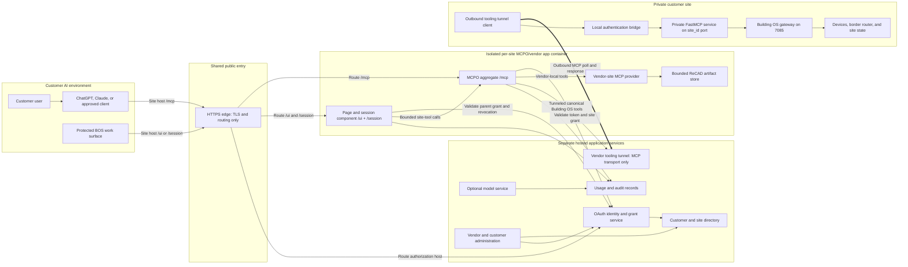

# Scratch: Hosted Building OS service-provider composition

> Status: SCRATCH, NON-CANONICAL, DISCUSSION RECORD
>
> Date: 2026-07-23
>
> This document develops the working model in which separate hosted services, isolated per-site MCPO/vendor app containers and the private vendor tooling tunnel together provide Building OS customer access. It is not an approved architecture document and does not replace anything under `architecture-docs/`.

## 1. Purpose

The vendor tooling tunnel started as the receiving half of an outbound connection. A private Building OS gateway connects outward, the vendor publishes a secure site-specific MCP address, and ChatGPT or Claude reaches the gateway's tools without exposing the customer network.

That transport is only one component of the commercial service. It does not own customer identity, OAuth, commercial records, protected pages or model access. Those remain separate application-service responsibilities around the tooling transport.

In this model, the hosted product provides these capabilities through explicit component boundaries:

- customer and site administration;
- a durable directory of customers, sites, gateways and public service addresses;
- user, client and support identities;
- OAuth grants, site roles and revocation;
- secure public access to each site's approved Building OS tools;
- protected browser work surfaces tied to the same authority;
- operational visibility across the connected fleet;
- usage, audit and subscription records;
- optional access to vendor-provided or customer-provided AI models.

The vendor is therefore not selling a generic database endpoint. Customers do not connect directly to SQL. Separate databases and application services support identity, administration, site routing, tunnel transport, tools, pages and optional models. The shared HTTPS edge only terminates TLS and routes by hostname and path.

## 2. Working statement

AI Lighting operates a public Building OS service composed of separate authorities. Each customer organisation has users, sites and gateways in the hosted directory. A separate OAuth identity and grant service authorizes ChatGPT, Claude and browser users. The shared HTTPS edge terminates TLS and routes the site hostname and path to an isolated per-site MCPO/vendor app container. That container serves `/mcp`, `/ui` and `/session` for the prototype, with page and session handling kept as a separable component. Only bounded MCP tool requests and responses cross the outbound vendor tooling tunnel to the private gateway. The gateway remains authoritative for live building state and performs every site operation locally under Building OS confirmation rules.

The service can later offer model access as a separate entitlement. A customer could continue using their own ChatGPT or Claude subscription and use AI Lighting only for Building OS tools. Another customer could receive an AI Lighting managed model endpoint, backed by an upstream provider or a vendor-operated model. Both paths would use the same customer, site, role, audit and billing control plane without making model access a requirement for tool access.

## 3. Existing repository foundation

The current source already contains a narrow version of this model.

### 3.1 Current vendor database

`tools/bos-vendor-addon/src/vendor/enrollment/db.ts` creates four SQLite tables:

- `vendor_sites`;
- `relay_enrollment_tokens`;
- `relay_connector_credentials`;
- `relay_site_access_keys`.

The current database knows a five-digit site ID, router unit serial, issue and expiry times, revocation state, one active connector credential per site, and named MCP access keys. The vendor returns newly issued enrolment tokens and site access keys once. The connector key is generated at the private site, submitted to the vendor once, stored there only as a hash, and never returned by the vendor.

This is a credential and tunnel registry. It is not yet a full customer service database. It has no customer organisations, human users, memberships, roles, OAuth grants, subscriptions, model entitlements, usage ledger, browser sessions, durable request queue or durable audit-event table.

### 3.2 Current administration surface

The vendor TUI under `tools/bos-vendor-addon/tui/` already provides seven operating areas:

1. Fleet;
2. Sites;
3. Accounts;
4. Access keys;
5. Tunnel routes;
6. Test loop;
7. Session action log.

It is a vendor-host operator surface over the loopback admin API. The existing API lists sites and sessions, issues enrolment tokens and site keys, and revokes credentials and sites. It reports Cloudflare routes only for active sites when a public domain is configured; otherwise that route returns `503 public_domain_not_configured`. It uses one vendor-wide admin bearer key. It does not implement individual vendor staff accounts, customer self-service, role separation or durable audit history.

### 3.3 Current tool service

`host/contracts/tooling/bos-tools.json` currently declares 35 Building OS tools. The local FastMCP service at `127.0.0.1:7087/mcp` projects a bounded subset of that common catalogue. With only the gateway binding it exposes eight tools. With a default border-router host pinned server-side it exposes nineteen.

The public relay does not invent another catalogue. It authenticates the public caller and routes the MCP request to the connected site. The connector sends the request to its own `127.0.0.1:<site_id>/mcp` facade using the separate private local key. That facade verifies the key, then injects it again while forwarding only to fixed port 7087. Public credentials do not reach the customer network, and the private FastMCP key does not leave it.

### 3.4 Current tunnel boundary

`architecture-docs/15-vendor-remote-access-add-on.md` and `tools/bos-vendor-addon/README.md` establish the current boundary:

- the site opens the connection outward;
- the customer exposes no inbound port;
- the public door grants access only to the bounded tool service;
- it does not provide a route into the customer LAN;
- connector credentials and public user credentials are separate;
- writes retain their own explicit confirmation requirements;
- site, credential and live tunnel-session revocation are vendor operations.

The current broker is held in memory and assumes one vendor process. The current public identity is a string attached to a site access key, not a full user or organisation identity.

### 3.5 Current AI boundary

`architecture-docs/12-ai-operator-surface.md` records that Building OS does not currently bundle a model. The reasoning model belongs to whichever consumer AI product the operator already uses. Building OS supplies the tools and domain knowledge.

The separate MCPO working copy at `D:\vibe-coded-projects\mcpo` demonstrates useful adjacent pieces: a public MCP proxy, self-hosted OAuth, provider registration, model catalogues and OpenAI-compatible completion routes. Its model code forwards calls to configured providers. It does not by itself make the current BOS vendor add-on a multi-tenant model service, and forwarding a provider is not the same as hosting a model.

### 3.6 Current checkout and release boundary

The vendor add-on is currently a private working-tree package. `/tools/bos-vendor-addon/` is ignored by the root `.gitignore` and explicitly excluded from the root npm workspaces. In this checkout, the connector record, HTTP MCP record, vendor architecture records and the 2026-07-22 scratch record are also untracked. The current implementation and tests are useful evidence, but this is not yet a versioned, reproducible vendor-service release boundary.

## 4. Proposed service shape

The hosted product is a composition of separate authorities and per-site runtimes.

| Component | Responsibility |
| --- | --- |
| Shared HTTPS edge | TLS termination plus hostname and path routing only. It does not authenticate users, resolve grants or own tunnel queues. |
| Commercial service | Customers, subscriptions, service tiers, invoices, quotas and support agreements. |
| OAuth identity and grant service | Users, AI clients, OAuth grants, memberships, roles, parent authorization and revocation. |
| Site directory and administration service | Sites, gateways, public addresses, container bindings, connector state and lifecycle. |
| Isolated per-site MCPO/vendor app container | Site-pinned `/mcp`, `/ui` and `/session` routes. For the prototype, the page/session component is co-deployed here but remains separable from MCPO and external OAuth. |
| Vendor tooling tunnel | Gateway MCP tool request and response transport only, including connector identity and bounded transport correlation or queue state. |
| Optional model service | Provider policy, customer model entitlements and model invocation. It does not use the gateway tooling tunnel. |
| Operations service | Health, fleet state, audit events, usage, alerts, deployment state and support evidence. |

Some prototype components may share a container or database where their authority remains explicit. The shared edge, OAuth authority, isolated site runtime and tool-only tunnel are settled boundaries, not one undifferentiated vendor add-on.

## 5. Network and authority topology



The shared edge makes no authorization or queue decision. It selects the isolated site container from vendor-owned hostname and path routing. The external OAuth service decides which authenticated principal may address that site. The per-site MCPO and page/session components enforce the site binding. MCPO aggregates a fixed vendor-local `vendor-site` provider with the tunneled canonical `building-os` provider. The tooling tunnel carries only the `building-os` provider's bounded MCP requests and responses. The gateway decides whether each declared Building OS operation is valid, whether confirmation is required, and whether the requested change can be applied locally.

## 6. Data ownership boundary

The vendor database should not become an unplanned duplicate of the live site database.

### 6.1 Vendor-authoritative data

The vendor should be authoritative for service-provider facts:

- customer organisations and reseller relationships;
- user identities and organisation memberships;
- registered sites and their commercial owner;
- gateway and router enrolment bindings;
- opaque tunnel IDs and public service addresses;
- connector credentials and rotation state;
- OAuth clients, grants, scopes and revocation;
- browser sessions and short-lived page handoffs;
- support access and approval windows;
- tool and page entitlements;
- model entitlements, provider policy and usage budgets;
- subscription, quota and billing records;
- security and administration audit events.

These records are vendor-authoritative but do not belong to the tooling tunnel. The OAuth service owns identities and grants, the page/session component owns browser handoffs and sessions, and the commercial and directory services own their respective records. The tooling tunnel retains only connector identity plus the transport state required to carry MCP requests and responses.

### 6.2 Gateway-authoritative data

The private gateway should remain authoritative for operational building truth:

- the current site hierarchy;
- spaces, devices and planned positions;
- commissioned hardware and live status;
- automation source and compiled ledgers;
- local network and Thread state;
- gateway-local credentials;
- accepted ReCAD import records, imported hierarchy and derived operational artefacts produced for local site operation;
- execution and read-back results for site mutations.

The vendor may retain bounded summaries needed for fleet health or customer navigation, but a cached summary must be labelled with its source, site, collection time and freshness. It must not silently become the source of truth for device control.

Bounded vendor-hosted ReCAD artifact storage is approved for the prototype inside the per-site vendor component. It owns the uploaded bytes, hash, authenticated owner, site binding, expiry, parsed inspection result and normalized import proposal. The gateway receives only a confirmed, remote-safe finalized import payload through MCP. After import, the gateway's read-back remains authoritative for the operational hierarchy and site state.

### 6.3 Upstream model-provider data

If AI Lighting brokers an upstream model, prompts, responses, files and tool-result context may cross from the separate optional model service to that provider. That is a separate data path from the site tunnel. It requires an explicit provider policy, retention statement, regional boundary and customer agreement. Tool access alone must not imply consent to send building data to a vendor-selected model provider.

## 7. Proposed tenancy model

The current `site_id + identity string + mcp scope` record is too small for the service-provider model. A proposed identity chain is:

```text
service provider
  -> customer organisation
      -> organisation membership
          -> user or service principal
      -> site
          -> gateway enrolment
          -> site role grant
          -> tool policy
          -> page sessions
          -> model entitlement
```

The principal may be:

- a customer employee;
- a lighting contractor working for that customer;
- an AI Lighting support technician;
- a ChatGPT or Claude connector installation acting for a user;
- a customer-owned automation identity;
- a vendor-operated service identity.

Identity alone is not authority. Each request must resolve a current grant containing at least:

- principal ID;
- customer organisation ID;
- site ID;
- allowed capability family;
- role or explicit scopes;
- issue, expiry and revocation state;
- parent authorization or support approval;
- optional quota and model budget.

## 8. Proposed control-plane records

The following is a candidate data model, not an approved migration or schema.

| Record | Purpose |
| --- | --- |
| `organisations` | Customer, reseller or vendor organisation identity and status. |
| `users` | Human identity independent of one customer or site. |
| `memberships` | User role inside an organisation. |
| `sites` | Commercial site record and the existing five-digit public identity. |
| `site_gateways` | Router serial, gateway installation and enrolment lifecycle. |
| `tunnels` | Opaque tunnel identity, credential generation, client version and connection state. |
| `oauth_clients` | Registered ChatGPT, Claude or other OAuth client metadata. |
| `oauth_grants` | User-approved authority and its scopes, expiry and revocation. |
| `site_grants` | The sites and capabilities a principal may access. |
| `tool_policies` | Catalogue projection, per-role restrictions and confirmation requirements. |
| `page_sessions` | Logged-in browser sessions linked to a parent grant. |
| `page_handoffs` | Short-lived swipe cards or authorization exchanges. |
| `model_providers` | Approved upstream or vendor-hosted model backends. |
| `model_entitlements` | Models, limits and provider policy available to a customer or user. |
| `usage_events` | Metered tool calls, model tokens, storage and service operations. |
| `audit_events` | Security and administrative actions with actor, target and outcome. |
| `subscriptions` | Commercial plan, enabled service families and lifecycle. |
| `artefacts` | Approved prototype ReCAD uploads and generated vendor previews with owner, site, hash, expiry and proposal state. |

Raw secrets should not be ordinary database fields. Connector keys, OAuth client secrets, provider API keys and signing keys need an explicit protected secret-store boundary. Hash-only storage remains appropriate for bearer values that only need verification. Reversible encryption is required only where the service must later use the secret, such as an upstream provider API key.

The records above do not imply one shared application database. Cross-service identifiers can link them while each service retains its own authority. In particular, page sessions and OAuth grants are not tunnel records, and tunnel queue state is not an HTTPS-edge record.

## 9. Tool access service

The tool service is the first commercial capability because it already matches the intended operator experience. The customer stays inside ChatGPT or Claude. The vendor gives that client a secure, customer-scoped route to the site's own Building OS tools.

### 9.1 Tunneled gateway-tool connection flow

1. AI Lighting or an authorised reseller creates the customer and site record.
2. The vendor issues a one-time gateway enrolment token bound to the router serial.
3. The private site generates its connector secret and enrols outward.
4. The vendor binds the gateway, site and opaque tunnel identity.
5. A customer user authorizes the official Building OS integration through OAuth.
6. The separate OAuth identity and grant service resolves the user, organisation, site grant and tool policy reference.
7. The AI client receives one bounded aggregate MCP catalogue containing the fixed `vendor-site` and `building-os` providers.
8. A `building-os` tool call enters the shared HTTPS edge, which routes the site hostname and `/mcp` path to that site's isolated MCPO container.
9. MCPO validates the token and site grant with the OAuth service, enforces the container's pinned site identity and records the authorized call.
10. MCPO routes the call only to the fixed tunneled `building-os` provider. The tooling tunnel service places it in that site's transport queue.
11. The gateway-side tunnel client receives the MCP request over outbound HTTPS.
12. A strict local bridge removes public authentication headers and injects the private FastMCP key.
13. The tunnel client calls `http://127.0.0.1:<site_id>/mcp`. FastMCP validates the catalogue operation and calls the Building OS gateway.
14. The result returns through the tooling tunnel with the same correlation and deadline.
15. MCPO and the operations service record the outcome without storing raw secrets or unrestricted payloads.

### 9.2 Provider aggregation and tool ownership

Each isolated site MCPO exposes one `/mcp` aggregate with exactly two server-pinned providers. Caller input cannot add a provider, select another site or change the tunnel target.

| Provider | Proposed tool ownership | Tunnel use |
| --- | --- | --- |
| `vendor-site` | Vendor-local bound-site context, swipe-card/session handoff, ReCAD artifact upload, inspection, proposal finalisation and confirmed import orchestration. Proposed IDs include `bos_bound_site_context`, `bos_get_swipe_card`, `bos_recad_upload`, `bos_recad_inspect`, `bos_recad_finalise_proposal` and `bos_site_populate_from_recad`. | None for local work. After confirmation, import orchestration submits only the finalized remote-safe payload through the fixed `building-os` provider. |
| `building-os` | The canonical Building OS gateway catalogue, including site truth, device, commissioning, automation and mutation tools. It also needs a remote-safe gateway import operation that accepts the finalized ReCAD payload. | Every call is carried through the site-bound tooling tunnel to `http://127.0.0.1:<site_id>/mcp`. |

The exact canonical tool ID and schema for the finalized ReCAD import remain to be frozen. The gateway never receives a vendor artifact ID, vendor filesystem path, browser cookie or swipe card.

### 9.3 Tool policy

The canonical Building OS catalogue remains the source of tool definitions. The OAuth/capability services should store grant and policy references, while each site-pinned MCPO derives the permitted projection. None should fork the tool implementations.

A customer's visible catalogue can be derived from:

- the catalogue version proven by the connected site;
- the site's declared capabilities;
- the caller's organisation and site role;
- the public-safe surface rules;
- server-pinned local targets;
- confirmation support available to the client;
- temporary support or commissioning approvals.

Tool confirmation remains a separate decision from authentication. A valid OAuth grant proves who is asking and which site they may address. It does not prove that a destructive operation was confirmed.

### 9.4 Offline behaviour

If the tooling tunnel is offline, the OAuth service can still authenticate the user and the hosted services can show site administration records, but the per-site runtime must report operational tools as unavailable. It must not queue unknown writes for later replay unless an entirely separate, explicitly designed deferred-command system is approved. The current BOS and OpenAI tunnel semantics avoid replay because a caller cannot safely assume an interrupted write did not execute.

## 10. Protected page, session and artifact components

The same service-provider identity can protect the individually callable BOS work surfaces described in `jobs/26-07-22/scratch-chatgpt-bos-operating-surface.md`.

The parent authority is the user or AI-client grant held by the separate OAuth service. A short-lived swipe card or authorization exchange may establish a browser session for the same user and site. The resulting page session can persist for the same authority horizon as tool access and must be revoked when the parent grant is revoked.

The OAuth service owns the user identity, parent grant, site authorization and parent revocation state. The page/session component owns:

- the page-session record;
- the user and site binding;
- the `/ui` and `/session` handlers behind the edge's site route;
- the authorization handoff;
- session revocation and audit.

For the prototype, this component is co-deployed inside the isolated per-site MCPO/vendor app container while remaining a separate code boundary. The shared edge routes `/ui` and `/session` to it on the same site hostname. Protected pages are vendor-rendered and obtain gateway truth through the site's bounded MCP tools. HTML, assets, redirects, cookies and browser sessions do not cross the vendor tooling tunnel, and the tunnel is not a general HTTP or page relay.

### 10.1 ChatGPT swipe-card candidate

The first ChatGPT checkpoint uses a component-mediated exchange candidate:

1. The vendor-local `bos_get_swipe_card` tool returns only safe status, surface and expiry fields in model-visible content.
2. The raw single-use card is delivered only in host/component-only tool-result `_meta`, with the exact metadata field and output-template binding frozen from the live host contract.
3. A minimal launcher component sends the card in the body of a same-origin `POST /session/exchange` request. It is not placed in a URL path, query string or fragment.
4. The page/session component validates the card, parent OAuth grant, pinned site, allowed surface, expiry and replay state.
5. On success, the response creates the protected browser session cookie and returns `303 See Other` to a clean `/ui/...` URL.

There is no query-token fallback. The raw card must not appear in model-visible content, browser history, referrers or ordinary logs. A live ChatGPT test must prove that component-only metadata reaches the intended component, the POST occurs in the browser context that receives the cookie, the clean redirect opens, the session persists, and parent-grant revocation closes it. If that proof fails, this candidate does not pass.

### 10.2 Bounded ReCAD artifact and import flow

Bounded vendor-hosted ReCAD storage is part of the prototype. The per-site artifact component stores the uploaded bytes and an expiring record bound to the authenticated subject and container site. It records the filename, media type, size, hash, inspection result and normalized proposal. It never accepts a caller-selected server path.

The vendor-local `bos_recad_upload` and `bos_recad_inspect` tools create and inspect that record without changing the gateway. `bos_recad_finalise_proposal` applies the resolved fields, requires all mandatory gaps to be closed and stores an immutable one-use final proposal hash. After the user confirms that exact hash, `bos_site_populate_from_recad` accepts only the artifact ID and final proposal hash, rejects drift or replay, and sends only the finalized remote-safe import payload through the fixed `building-os` provider. The gateway never resolves a vendor artifact ID or vendor path. The resulting hierarchy and operational state are read back through canonical gateway tools and remain gateway-authoritative.

## 11. Optional model access service

Model access is adjacent to tool access, but it is not the same service and should not be collapsed into the tunnel protocol.

### 11.1 Tool access without vendor model access

This remains the primary path. The customer uses their existing ChatGPT, Claude or other AI product. That product supplies the model and conversation. Separate AI Lighting services supply the Building OS integration, authorization, tools, pages and tooling transport.

In this path:

- model prompts and responses stay within the customer's chosen AI product;
- the vendor sees only the Building OS calls that reach its public service;
- the customer pays their AI provider directly;
- AI Lighting charges for the hosted site connection, administration and support service.

### 11.2 Vendor-provided model endpoint

AI Lighting could optionally expose a model endpoint to customers who do not want to procure or configure their own provider. The external OAuth service would authenticate the customer. The separate model service would validate the model entitlement and budget, select an approved backend, meter usage, and forward the request.

This can be an OpenAI-compatible model gateway without being an AI Lighting hosted model. The backend might be OpenAI, Anthropic, Google, OpenRouter, a customer endpoint, or a model deployed on AI Lighting infrastructure. The customer-facing contract and the actual backend are separate records.

The MCPO source is relevant here because it already contains provider registration, model catalogue and completion-routing concepts. It is a source of reusable model-gateway code, not proof that the BOS vendor service already provides this product.

### 11.3 Customer-provided model credentials

A customer could bring its own provider account while using the vendor's unified endpoint and policy controls. This reduces vendor-funded token risk but requires the service to store or broker a customer secret securely. It also needs clear ownership of provider failures, quotas and data-processing terms.

### 11.4 Vendor-operated model

AI Lighting could eventually operate a model on its own compute. That is a different operational commitment involving model weights, inference capacity, GPU scheduling, patching, regional deployment, latency and abuse controls. Nothing in the current BOS vendor add-on or MCPO proxy proves this capability.

### 11.5 Model API versus managed agent

A raw model endpoint does not automatically operate Building OS tools. It returns text or tool-call proposals. The customer's AI harness normally performs the tool loop.

If AI Lighting offers a complete managed assistant that selects and executes tools itself, the vendor must also run an agent runtime. That runtime becomes another privileged principal with conversation state, tool policy, confirmation handling and audit requirements. It should be treated as a later product, not silently implied by adding `/v1/chat/completions`.

### 11.6 Recommended service order

The first service should provide reliable customer identity and tool access to the AI products customers already use. The model gateway can then be added as an optional entitlement using the same organisation and billing records. A vendor-managed agent should come later, after tool authorization, confirmation and audit have been proved with external AI clients.

## 12. Shared identity, separate grants

Tool, page and model services can use one login and one customer directory without sharing one unrestricted token.

A parent OAuth authorization can create narrower grants such as:

```text
site:31886:tools:read
site:31886:tools:commission
site:31886:pages:view
site:31886:pages:interact
models:catalog:read
models:invoke
support:site:31886
```

These names are examples only. The important boundary is that model access must not automatically grant a site write, page access must not automatically grant model spend, and support access must be visible, time-bounded and revocable.

The connector credential remains completely separate. It authenticates the gateway process to the vendor tunnel service. It represents infrastructure, not a human user, customer subscription or permission to operate the site.

## 13. Vendor administration model

The existing TUI can grow from tunnel administration into the provider's operating console.

### 13.1 Fleet administration

- customers and their active service plans;
- sites, gateway bindings and tunnel health;
- catalogue versions and compatibility state;
- credentials approaching expiry;
- failed enrolments and repeated authentication failures;
- per-site rate, latency and availability;
- service incidents and maintenance state.

### 13.2 Identity administration

- customer administrators and members;
- AI client registrations;
- active OAuth grants and browser sessions;
- site roles and temporary support grants;
- revocation history;
- suspicious cross-site or repeated-denial events.

### 13.3 Capability administration

- enabled tool families by plan and role;
- connected gateway capabilities;
- page-service availability;
- model providers and approved model catalogue;
- customer model entitlements and budgets;
- disabled capabilities with explicit reasons.

### 13.4 Commercial administration

- subscription status;
- connected-site count;
- service tier;
- model and storage budget;
- usage totals and invoice evidence;
- trial, suspension and offboarding state.

The vendor operator console and customer self-service surface are different. The current loopback TUI is appropriate for trusted vendor-host operations. Customer administrators will eventually need a separately authenticated, customer-scoped surface that cannot see other organisations or vendor-only secrets.

## 14. Customer lifecycle

### 14.1 Customer creation

1. Create the customer organisation.
2. Assign the first customer administrator.
3. Select the service plan and enabled capability families.
4. Create the first site record or reserve the enrolment binding.
5. Record commercial ownership and support relationship.

### 14.2 Gateway enrolment

1. Issue a one-time token for the actual router serial.
2. Let the site generate its connector secret locally.
3. Bind the resulting gateway to the customer site.
4. Record the tunnel identity and public addresses.
5. Prove the expected local catalogue before marking tool access available.

### 14.3 User connection

1. User signs into the AI Lighting authorization service.
2. User chooses or is assigned an organisation and site.
3. The service presents the requested capabilities.
4. User authorizes the official ChatGPT, Claude or other client.
5. The service issues a scoped grant and exposes the bounded catalogue.

### 14.4 Normal operation

1. The AI client calls tools or opens protected pages.
2. The shared edge routes the site hostname and path without making an authorization decision.
3. The OAuth service resolves the principal, organisation and site grant.
4. The isolated site runtime enforces its pinned site and either serves the protected page or submits a bounded tool call.
5. Only tool requests and responses cross the tooling tunnel; the site performs the operation locally.
6. Usage and security outcomes are recorded by the responsible application services.
7. Customer and vendor operators see bounded health and audit evidence.

### 14.5 Support access

Vendor support should not depend on a permanent global site key. A support grant should identify the technician, customer, site, purpose, scope, approval source and expiry. The customer should be able to see and revoke it. High-risk work remains subject to Building OS confirmation rules.

### 14.6 Suspension and offboarding

Suspension should distinguish commercial access from site safety. It can stop new public tool and model sessions without corrupting the private gateway or disabling local building operation. Final offboarding should revoke grants and connectors, terminate sessions, export required records, apply the retention policy and release public routes without deleting customer-owned site data from the gateway.

## 15. Audit and usage model

The existing TUI action log is local to one TUI session. A service provider needs a durable audit record.

Each security or administration event should record bounded fields such as:

- event ID and time;
- actor principal and actor organisation;
- target customer, site or credential;
- operation category;
- requested capability;
- authorization decision;
- outcome and safe error code;
- request correlation ID;
- source client and tunnel instance;
- policy version;
- confirmation evidence reference where applicable.

It should not record raw access tokens, connector keys, provider API keys, swipe cards, browser cookies or unrestricted MCP request bodies.

Usage metering and security audit should remain related but distinct. Billing may need counts, durations, bytes, model tokens and storage. Security audit needs actor, grant, target and decision evidence. One should not be forced to retain sensitive payloads merely because the other needs an invoice total.

## 16. Commercial service model

The hosted product composition can support recurring services without forcing AI Lighting to sell a proprietary operator application.

Possible billable units include:

- active connected sites;
- customer and support seats;
- service tier or support response level;
- retained audit history;
- hosted artefact storage;
- vendor-provided model tokens;
- premium model or regional-provider access;
- managed commissioning or support sessions.

The primary moat remains the secure hosted relationship between customer identity, site identity, gateway enrolment, tool policy and operational support. Model resale can add value, but the service should still work when a customer brings its own ChatGPT or Claude account.

## 17. Security boundaries

### 17.1 Tenant isolation

Every request must resolve the same site from two independent facts: the edge's vendor-owned hostname route and the OAuth service's authenticated grant. The isolated MCPO/vendor app container is pinned to that site. A caller must never provide an arbitrary container, tunnel target, internal URL or site destination. Site mismatch must fail distinctly and be audited before a tool request reaches the tunnel.

### 17.2 Header and local-key isolation

The OpenAI tunnel client source reviewed at commit `e288bde76d811e4fc5e2ca076775eab04459c682` forwards control-plane-supplied headers and lets them override static local headers. In the current-state 7087 path, BOS cannot expose that service directly through this behaviour. The target tunnel client must remove public `Authorization`, cookies, proxy headers and other sensitive values, then inject the gateway-local FastMCP key after filtering and call `http://127.0.0.1:<site_id>/mcp`.

### 17.3 Database and secret isolation

- bearer verifiers should store hashes, not plaintext;
- reusable provider credentials require a protected secret store;
- database backups require encryption and tested restoration;
- production database access must not be exposed through customer APIs;
- customer export and retention rules must be explicit;
- logs and support bundles must redact credentials and personal data.

### 17.4 Model isolation

- customer model budgets must be enforced before forwarding;
- provider selection must come from approved server policy;
- one customer's provider key must never serve another customer;
- prompts and tool results must follow the customer's provider and retention policy;
- model invocation must not grant additional tool scopes;
- model-generated tool calls remain subject to normal schema, policy and confirmation checks.

### 17.5 Administration isolation

The current single admin API key is suitable only for the present trusted loopback boundary. A multi-operator provider service needs named staff identities, roles, strong authentication, short sessions, action confirmation and durable audit. Customer administration must be tenant-scoped and separated from vendor infrastructure administration.

## 18. Reliability boundary

The tooling transport needs stronger guarantees than the present one-process relay, while the other application services need their own durability and availability boundaries.

Required production properties include:

- durable customer, identity and grant records;
- a tooling-tunnel-owned durable or carefully acknowledged per-site transport queue;
- bounded queues and backpressure;
- request deadlines carried through gateway work and response delivery;
- no automatic replay of uncertain site mutations;
- connection leases so only the accepted tunnel client receives work;
- restart-safe correlation state;
- horizontal routing or an explicit single-active failover design;
- health that distinguishes the routing edge, OAuth service, site directory, isolated site runtime, tooling tunnel queue and private-site connectivity;
- backup restoration and credential-revocation drills;
- per-tenant, per-site and per-principal limits;
- observable catalogue mismatch and client-version drift.

An offline site is not a failed customer identity service. A working login does not mean the gateway is reachable. A working edge route does not prove OAuth, MCPO or tunnel health. The service and UI should report those states separately.

## 19. OpenAI tunnel-client reuse

The open-source OpenAI client is a suitable foundation for the gateway-side transport because it supplies outbound HTTPS polling, bounded work queues, deadlines, retries, MCP forwarding, metrics and local operations.

It also supplies the precise client-facing control-plane contract that the BOS tooling tunnel service would have to implement:

- `GET /v1/tunnels/{tunnel_id}`;
- `GET /v1/tunnels/{tunnel_id}/poll`;
- `POST /v1/tunnels/{tunnel_id}/response`.

These three endpoints are not the complete hosted product. Public caller ingress and OpenAI's production server are absent from the repository. Its included `pkg/localproxy` server is an in-memory development control plane, not a production vendor service. BOS still needs separate owners: the shared edge for TLS and routing, OAuth for customer identity and grants, the site directory for site and container mapping, isolated MCPO containers for tool ingress, and the tooling tunnel for transport queues and correlation. Limits, audit and high availability apply at each boundary.

The current five-digit BOS site ID should remain a human and public site identity. The tunnel protocol should use a separate opaque tunnel ID. The vendor database maps the two. The public address can remain site-friendly while the internal queue and client credentials use opaque identifiers.

The shared HTTPS edge does not replace per-site MCPO/vendor app containers or their internal listeners. It exposes one public TLS entry and routes each site hostname and path to the correct isolated container. The edge does not authenticate the caller or own tunnel queues. The separate tooling tunnel service maps the container's site-pinned MCP request to an opaque tunnel ID and owns only the transport queue and correlation state.

## 20. Suggested delivery sequence

### Stage 1: Site directory, isolated runtime and edge routing

- add customer organisations and site ownership;
- retain current gateway enrolment and revocation;
- map each five-digit site to an opaque tunnel ID and one isolated MCPO/vendor app container;
- provision the shared edge to route the site's hostname and `/mcp`, `/ui` and `/session` paths to that container;
- keep the edge limited to TLS and routing;
- provide named vendor operator identities and durable admin audit in the separate administration service.

Pass condition: two customer organisations can exist with separate sites and isolated containers. Each hostname reaches only its assigned container, a deliberately wrong site route cannot address the other container, and the edge neither issues a grant nor places a tunnel request.

### Stage 2: Separate customer OAuth and grants

- add users, memberships and site roles to the OAuth identity and grant service;
- register the official external AI clients;
- issue scoped, revocable site grants;
- have `/mcp`, `/ui` and `/session` validate the external grant and match it to the container's pinned site;
- derive one bounded aggregate catalogue containing only the fixed `vendor-site` and `building-os` providers.

Pass condition: two users with different site roles see different approved catalogues. A token for one site fails at another site's container, and revocation stops an active client without changing the private gateway key.

### Stage 3: Tool-only production tunnel transport

- implement the pinned MCP poll-and-response protocol in the tooling tunnel service;
- adapt the gateway client to call `http://127.0.0.1:<site_id>/mcp` behind the strict local auth bridge;
- keep current byte, rate, concurrency and confirmation boundaries;
- keep queue, lease and correlation state inside the tooling tunnel service;
- reject page GETs, HTML, assets, browser redirects and cookies at the tunnel boundary;
- add durable correlation and restart behaviour without replaying uncertain writes.

Pass condition: a real bounded MCP tool call reaches the assigned gateway and returns through the tunnel. After a tunnel-service restart, persisted transport state is either completed from recorded evidence or resolved as unknown without replaying a gateway mutation. Cross-site and non-MCP requests are rejected before reaching either gateway.

### Stage 4: Protected pages

- add one vendor-rendered read-only site page in the separable page/session component co-deployed in the prototype site container;
- bind its browser session to the parent OAuth grant;
- deliver the card only through component-only metadata, POST it to `/session/exchange`, and redirect with a clean `303` to `/ui/...`;
- fetch gateway truth only through the site's bounded MCP tools;
- prove revocation covers tools and pages;
- keep HTML, assets, redirects and cookies outside the tooling tunnel.

Pass condition: an authorised user opens the page without another manual password, an unauthorised user cannot read it, and revocation closes both access paths. The page's gateway data is traceable to bounded tool results, no browser payload crosses the tooling tunnel, and no card appears in a URL or model-visible content. There is no query-token fallback.

### Stage 5: Bounded ReCAD artifacts and confirmed import

- store uploaded ReCAD bytes in the per-site vendor artifact component with owner, site, hash and expiry;
- inspect and normalize the artifact through vendor-local tools without a gateway write;
- finalise the resolved gaps into an immutable one-use proposal hash and require confirmation of that exact hash;
- send only the finalized remote-safe import payload through the fixed `building-os` provider;
- read the imported hierarchy back from the gateway.

Pass condition: artifact and grant mismatches fail before the tunnel, inspection makes no gateway change, and only a confirmed finalized payload reaches `http://127.0.0.1:<site_id>/mcp`. The read-back matches the pinned site.

### Stage 6: Customer administration

- provide customer-scoped user, site, grant and session views;
- expose usage and service state without vendor-only infrastructure details;
- add support-access request and approval records.

Pass condition: a customer administrator can manage only its own organisation and can see every active grant to its sites.

### Stage 7: Optional model gateway

- add provider and model records;
- add customer entitlements and budgets;
- support one approved upstream provider first;
- meter and audit model calls separately from tool calls;
- keep external ChatGPT and Claude tool access working unchanged.

Pass condition: model access can be enabled or disabled per customer without changing site tool grants, and one customer's budget or provider key cannot be consumed by another.

## 21. Current and proposed boundary matrix

| Area | Current source | Proposed service-provider model |
| --- | --- | --- |
| Site registry | Five-digit site and router serial | Site belongs to a customer organisation and maps to an opaque tunnel. |
| Admin identity | One loopback admin bearer | Named vendor staff with roles, sessions and durable audit. |
| Customer identity | Named access-key string | Users, memberships, OAuth clients and scoped site grants. |
| Tool scope | Fixed `mcp` scope | Role and capability policy derived from the canonical catalogue. |
| MCP providers | One bounded gateway catalogue | MCPO aggregates fixed `vendor-site` local tools with the tunneled canonical `building-os` provider. Caller input cannot select providers or targets. |
| Shared public edge | Site-specific public listeners | One TLS endpoint routes each site hostname and path to its isolated container. It owns no OAuth decision or tunnel queue. |
| Site runtime | One same-number MCP listener per enrolled site | One isolated MCPO/vendor app container per public-tooling site, with internal `/mcp`, `/ui` and `/session` handlers behind the edge. |
| OAuth | Not implemented in the BOS vendor add-on | Separate identity and grant service used by MCPO and the page/session component. |
| Tunnel | One WebSocket session and listener per site | Tool-only MCP poll-and-response transport between each site container and its private gateway. |
| Gateway MCP target | Current shared service on `127.0.0.1:7087/mcp` | Steady-state direct site FastMCP on `http://127.0.0.1:<site_id>/mcp`. |
| Queue | In-memory broker | Tooling-tunnel-owned durable or explicitly leased MCP transport state with bounded backpressure. |
| Public access | Site bearer key | The edge routes; external OAuth authorizes; the pinned site container enforces the scoped grant. |
| Pages | Not implemented | Vendor-rendered per-site work surfaces in a separable page/session component, co-deployed in the prototype container and populated through bounded MCP tools. |
| ReCAD artifacts | No remote artifact store | Approved bounded storage in the per-site vendor component; only a confirmed finalized import payload crosses MCP to the gateway. |
| Audit | Credential timestamps and local TUI action log | Durable actor, grant, target, policy and outcome records. |
| Billing | Not implemented | Connected-site, service-tier and optional model-usage records. |
| Models | Not bundled by BOS | Separate optional model service, customer BYOK or later vendor-operated models. It does not use the tooling tunnel. |
| Live building truth | Private gateway | Remains private-gateway authoritative. |

## 22. Explicit non-goals

This model does not require:

- a public inbound port at the customer site;
- a route into the customer's LAN;
- a duplicate cloud copy of all live building state;
- a proprietary Building OS chat application;
- vendor model access for customers already using ChatGPT or Claude;
- automatic replay of interrupted writes;
- replacing the canonical Building OS tool catalogue;
- letting model output bypass confirmation or gateway validation;
- exposing the vendor database directly to customers;
- turning the first implementation into many network microservices.

It also does not permit:

- the shared edge to issue OAuth grants, decide site authority or own tunnel queues;
- the tooling tunnel to own organisations, billing, OAuth, pages, browser sessions, models or general service-provider state;
- HTML, assets, redirects or cookies to cross the gateway tooling tunnel;
- a protected page to obtain gateway data through an arbitrary HTTP or LAN relay;
- the shared edge to replace the isolated per-site MCPO/vendor app containers.

## 23. Unresolved decisions

The following still need evidence or an explicit product decision:

- whether AI Lighting is the only service provider or lighting companies become first-class reseller tenants;
- whether customers can self-create sites or only vendors and resellers can enrol gateways;
- the exact OAuth identity provider and account-recovery model;
- the initial customer roles and tool-policy vocabulary;
- the safe confirmation interaction supported by ChatGPT and Claude;
- the exact component-only metadata field, output-template binding, cookie attributes and live browser-context behaviour for the POST/clean-303 candidate;
- whether the separable page/session component remains co-deployed with each site container after the prototype;
- the production database engine and migration discipline;
- queue durability and multi-instance routing design;
- customer data location, retention, export and deletion terms;
- whether model access uses vendor credentials, customer credentials or both;
- which model providers and regions are acceptable;
- whether AI Lighting ever offers a managed agent rather than only a model endpoint;
- model token pricing, hard budgets and failure behaviour;
- support access approval and emergency-access policy;
- service suspension behaviour during billing or security incidents;
- the migration path from current site access keys to OAuth grants;
- the package boundary between MCPO, the co-deployed page/session component and the existing private vendor add-on.

## 24. Source record

Repository sources read for this note:

- `architecture-docs/12-ai-operator-surface.md`
- `architecture-docs/15-vendor-remote-access-add-on.md`
- `host/contracts/tooling/bos-tools.json`
- `host/runtime/chatgpt_mcp/README.md`
- `host/runtime/server/VENDOR-RELAY-CONNECTOR.md`
- `jobs/26-07-17/vendor-admin-tui-design.md`
- `jobs/26-07-22/scratch-chatgpt-bos-operating-surface.md`
- `tools/bos-vendor-addon/README.md`
- `tools/bos-vendor-addon/src/vendor/admin-routes.ts`
- `tools/bos-vendor-addon/src/vendor/enrollment/db.ts`
- `tools/bos-vendor-addon/src/vendor/credentials/types.ts`
- `tools/bos-vendor-addon/tui/tui/shell/main_screen.py`
- `tools/bos-vendor-addon/tui/tui/shell/registry.py`
- `.gitignore`
- `package.json`

External source boundaries used:

- OpenAI `tunnel-client` source at reviewed commit `e288bde76d811e4fc5e2ca076775eab04459c682`, especially `docs/architecture.md`, `docs/protocol.md` and `pkg/localproxy/localproxy.go`;
- MCPO working copy at `D:\vibe-coded-projects\mcpo`, especially its OAuth, provider registry, model catalogue and completion-routing code.

Observed current behaviour and proposed future behaviour are deliberately separated throughout this document. No database migration, service implementation or product decision is approved by this scratch record.

## 25. Short product statement

AI Lighting's hosted Building OS product is a composition, not one enlarged tunnel service. A shared HTTPS edge performs TLS and hostname/path routing. A separate OAuth service authorizes people and AI clients. Each public-tooling site has an isolated MCPO/vendor app container serving `/mcp`, `/ui` and `/session`, with page/session code kept separable. The vendor tooling tunnel carries only bounded gateway MCP requests and responses. Commercial, directory, administration, audit and optional model services keep their own responsibilities. The gateway remains inside the building and authoritative for building state and execution, while ChatGPT, Claude or another client remains the normal operator surface.
